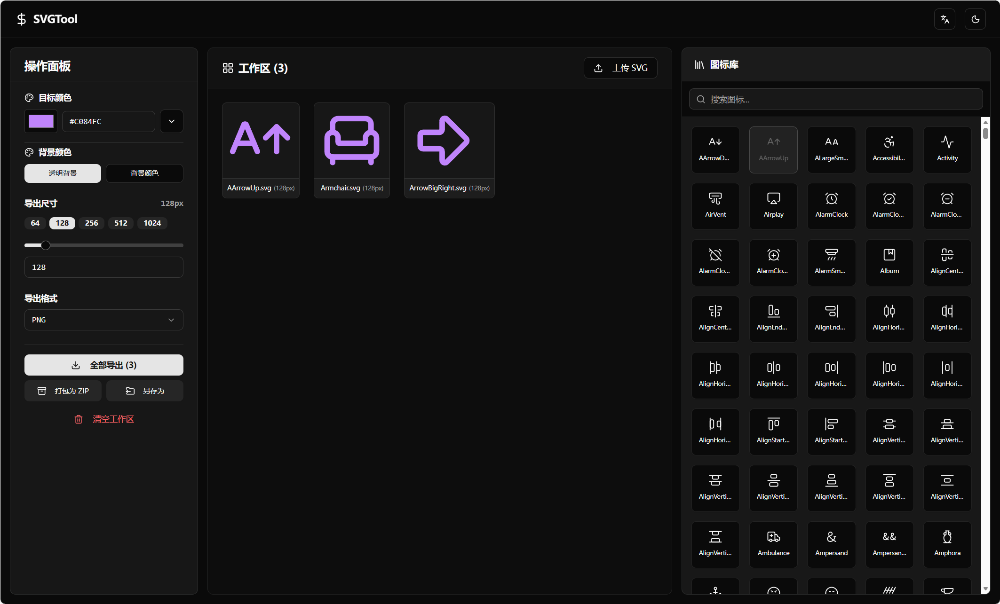

# SVG Tool 
A modern, web-based SVG manipulation and icon management toolkit.

## Features 

- **SVG Workspace**: Upload, edit, and instantly preview custom SVG files in your browser.
- **Icon Library Integration**: Quick-search and one-click add directly from the massive `lucide-react` icon library.
- **Color Manipulation Engine**: Use the built-in color picker or our curated Tailwind CSS color scale dropdown to universally alter active icons seamlessly.
- **Dynamic Visio-Spatial Syncing**: Icons automatically and smoothly scale into the layout space mirroring your active export-size parameters.
- **Save to Directory (Save As)**: Leverage the modern File System Access API to pick a destination folder and push all uniquely styled icons straight into it—bypassing the clutter of your default "Downloads" root.
- **Export As ZIP**: Package your entire workspace with a single click.
- **Export History Tracker**: Locally caches your recent parameter configurations (Size, Background, Target Color) for 1-click redeployment.
- **Responsive Layout**: Designed utilizing declarative Shadcn UI tabs that automatically reconfigure layout grids across wide-screen desktops, tablets, and mobile phones natively.

### Installation

#### Desktop App (Windows)
A native standalone Windows `.exe` installer is automatically compiled for this project. Simply navigate to the **Releases** tab on the right side of this GitHub repository to download and install the latest version.

#### Local Development
1. Clone the repository
2. Run `npm install` inside the project root folder.
3. Start the Vite dev server with `npm run dev` (or `npm run tauri dev` for Desktop UI).

#### Docker

```bash
docker run -d --restart always -p 1999:1999 --name svgtool ghcr.io/username/svgtool:latest
```

#### GitHub Packages
<a href="https://sakuraofficial.github.io/svgTool/">https://sakuraofficial.github.io/svgTool/</a>

### Desktop App (Tauri)
This project features native `.exe` build integrations via **Tauri**.
Pushing a tag (e.g., `v1.5.0`) automatically kicks off the `.github/workflows/tauri-publish.yml` GitHub action.
It spins up a Rust Windows-latest compiling environment, bundles the React application, and seamlessly attaches the `.msi` and `.exe` Installer to a new GitHub Release.

## Technologies Used
- React 18
- Vite
- Tailwind CSS v4
- Shadcn UI (Radix Primitives)
- Lucide React
- react-i18next (Internationalization)
- JSZip (File bundling)
- @tanstack/react-virtual (High performance DOM mapping)
